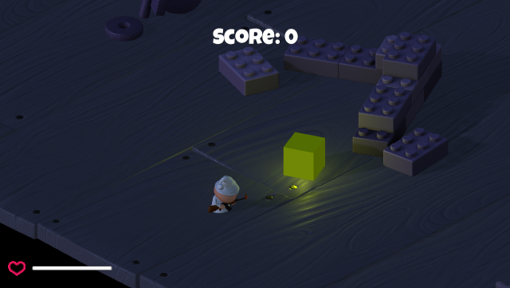

# Survival Shooter

Sebuah game dimana kita harus mengalahkan musuh yang datang dan bertahan selama mungkin.

## Deskripsi
Ini adalah Survival Shooter yang dibuat dengan Unity, yaitu dimana player harus bertahan dari serangan musuh dengan cara menembak musuh sampai mati. Untuk memainkan permainan ini pemain hanya perlu bergerak dengan "WASD" dan menembak musuh dengan menggunakan klik kiri dari mouse. Pemain diharapkan dapat bertahan selama mungkin dan mengalahkan musuh sebanyak mungkin. Game ini dibuat dalam rangka pembelajaran Studi Independen Game Development Bootcamp bersama Agate Academy.

## Menjalankan game
Untuk memainkan permainan hanya perlu mendownload build dari game nya yaitu yang bisa didownload pada release. Setelah itu bisa menjalankan file executable nya untuk menjalankan game.

## Fitur Tambahan
- New power up -> Speed boost & Heal item (script berada pada folder PowerUp)

Power up bisa ditemukan di bagian kiri map, jika berwarna kuning maka powerup adalah speed boost, jika berwarna merah maka adalah heal. Cara menggunakannya dengan menabrakan player ke object powerupnya, maka karakter akan meng-collect powerup tersebut.

## Authors
Ignatius Dwiki Iskandar (Haelinythii)

ID Agate: 321